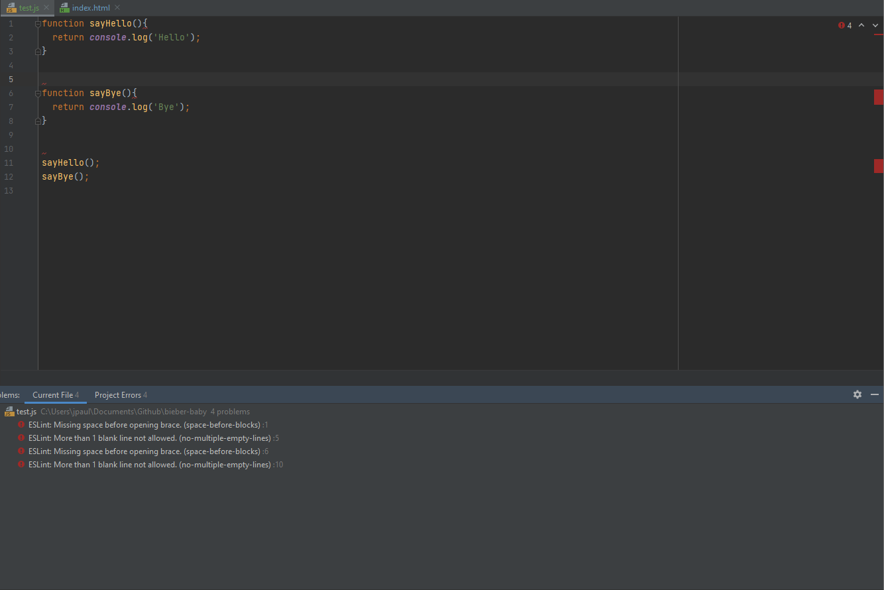
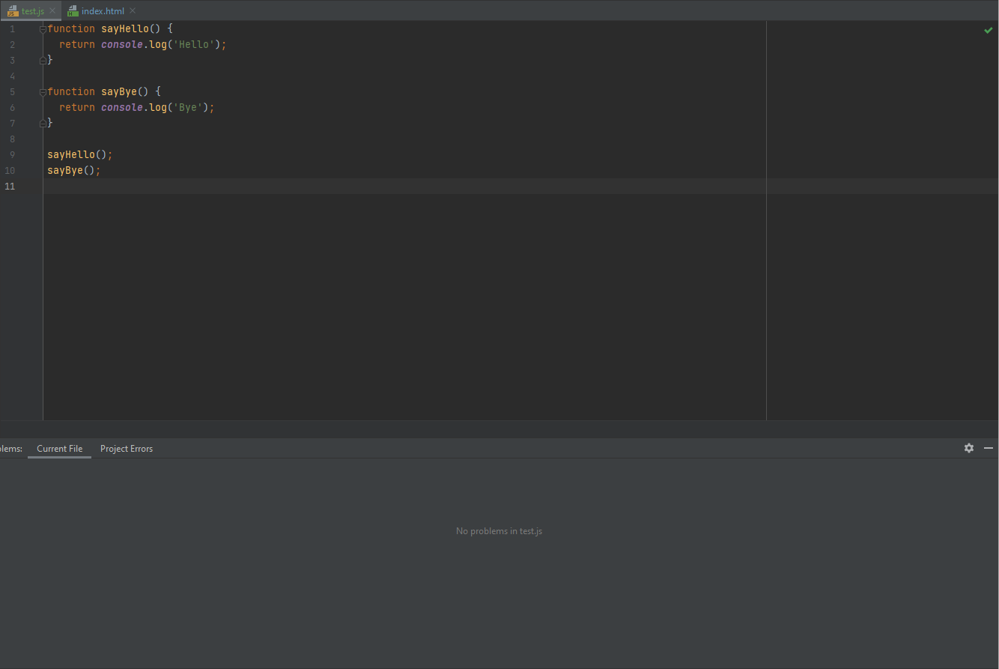

When I first started programming my Discord bot, I didn't know nor did I abide by any coding standards. It was all spaghetti code where I just put whatever wherever. When I didn't know why a certain line of code didn't work, my first thought was to paste it elsewhere and hope that it works there. That happened a few times when I was coding my Discord bot. I didn't know anything about scopes, or any coding etiquettes. I just put code in and if it works, it works. Fast forward to when I actually took classes on programming at UH Manoa, I was given a coding standard to abide to. That significantly changed the way I code. Following coding standards makes it so much easier to read and write code. It would be a pain to code without those standards in place.

## A week of using ESLint with IntelliJ

Although following coding standards is a must nowadays, I'll be honest. I don't usually always follow ESLint while coding. Even though ESLint helps significantly with fixing the appearance of the code, it annoys the hell out of me when I see a ton of red squiggly lines attached to errors. I separate my functions with multiple spaces so I can visually tell them apart. ESLint doesn't like multiple spaced lines and will put a huge error in between them, showering the code with red squiggly lines. It's truly painful abiding by the ESLint coding standard while writing code.

That's why I usually either ignore ESLint completely or disable it until the very end where I have tested my code and know that it works. Only then would I fix any warnings that popped up, which are usually only appearance issues. The spaced out functions? Gone. Some lines of code not typed correctly to comply to standards? Reformatted. I check all of the appearance errors at the end. When that green checkmark appears, that's when I can be truly done with the code.

## Being okay with coding standards

Coding standards gives a universal way to read and write codes to those that abide it. Coding is similar to note taking. If you only you write your own code and you don't share it with anyone else, you don't necessarily need to follow a coding standard. Doesn't matter if no one else can read it, only you need to be able to. I think this is fine for a solo project where you don't intend to share the source code. Coding for a class however, you will have to follow a coding standard so that others can read your code efficiently. You're no longer coding for yourself, you're coding to show others. People just don't have the time to rummage through spaghetti coding to make sense of it. The code needs to be readable, and that's where coding standards is king. A universal way to read, write, and understand code will significantly reduce the unnecessary overhead of trying to understand nonsense. Reading the code will be snappy and quick, this then leads to easier troubleshooting when necessary.
