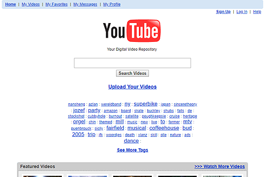
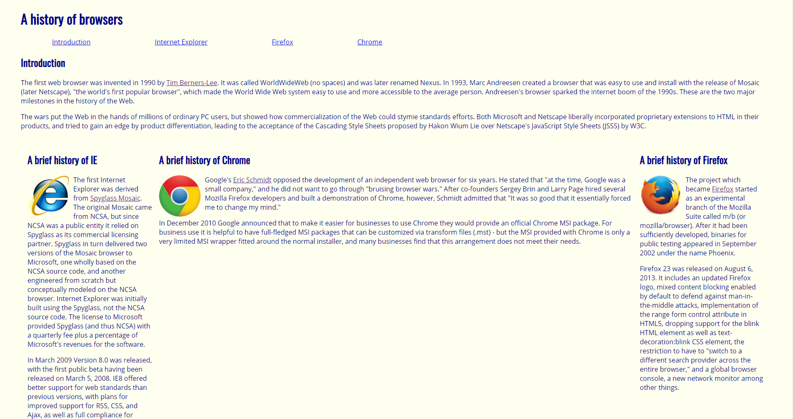
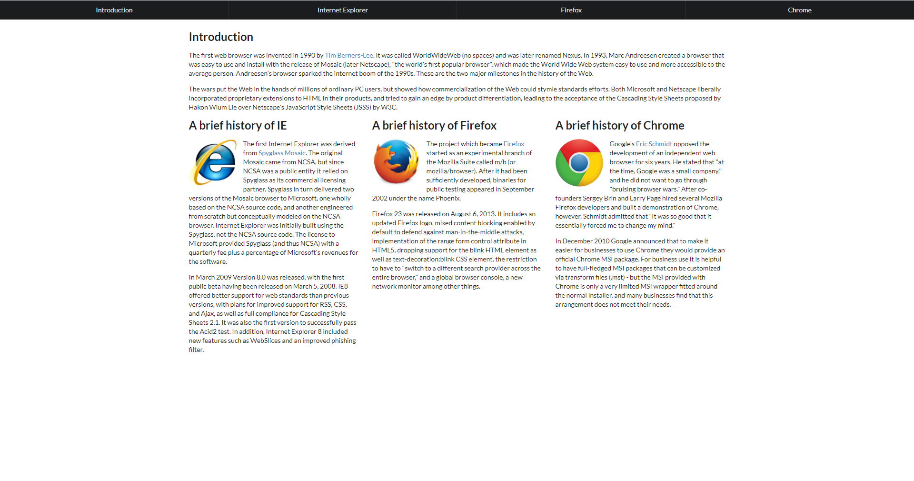

2005 Youtube website | Modern Youtube website
-------------------- | ----------------------
 | 

When I started learning about HTML and CSS, I just learned the basics. Creating a webpage with text and images seemed simple enough. Nothing looked weird or unordinarily out of place. If anything, creating a raw HTML and CSS just reminds me of old webpages that had just text all over it. Not necessarily nostalgic for me, but It just dawned on me that this is how webpages in its simplest form were created back in the day. Nowadays though, everything needs to look modern. It's unacceptable to leave webpages as just text on a screen. Navigation through the webpages also needs to be easy. Users will have to take one look at a webpage and know how to traverse it within a second. All of this could be done using raw HTML and CSS, but UI Frameworks help keeps things small and clean.

## Although important, UI Frameworks is not a necessity

One thing that I can say though is that UI Frameworks are not a necessity, but that's mainly because everything can still be done using raw HTML and CSS. UI Frameworks just provides shortcuts for using those tools. I think it's similar to the argument I made for coding styles where they aren't necessary, but it is helpful to have them. I believe that if you're a master at raw HTML and CSS, the most you'll get out of using a UI Framework is the reduction of code lines, after going through the frustration of having to learn it though. That being said, if you're someone like me who's just starting to learn the basics of HTML and CSS, UI Frameworks are great stepping stones for learning.

My history of browser webpage using basic HTML and CSS | My history of browser webpage incorporating Semantics UI
------------------------------------------------------ | --------------------------------------------------------
 | 

## Then why bother learning UI Frameworks?

Simply put, it makes things simpler. When coding, you want to keep things simple and not have to repeat code. Essentially, less is less. The reduction of code from learning a UI Framework may seem small, but that piles up the more content a webpage contains. It's better to learn that you can optimize your code now than to try and optimize it later after just finding out that you could do things much simpler.
