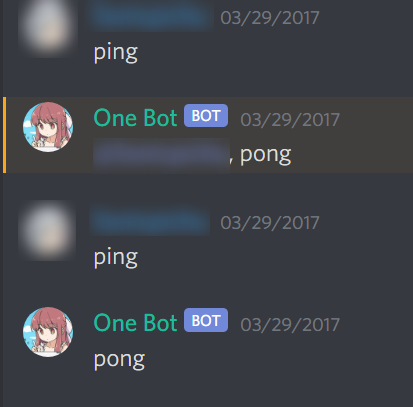
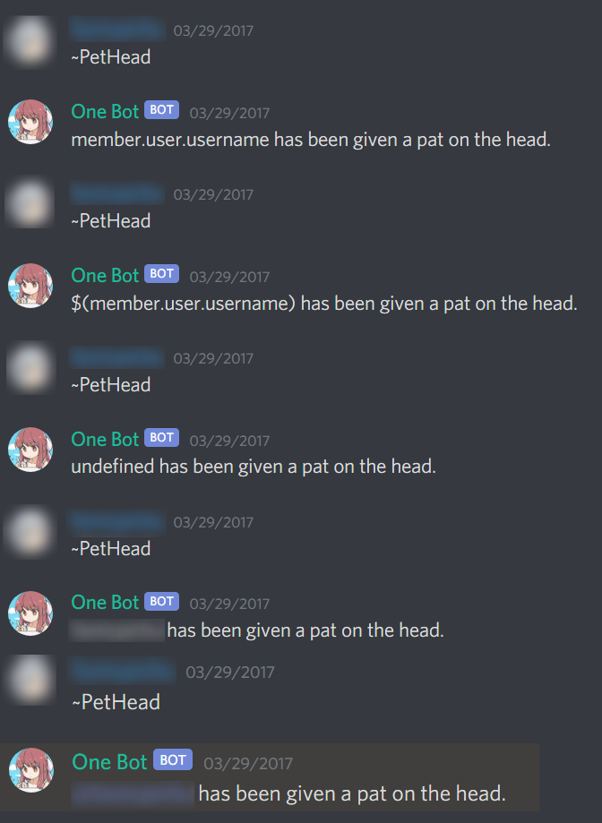
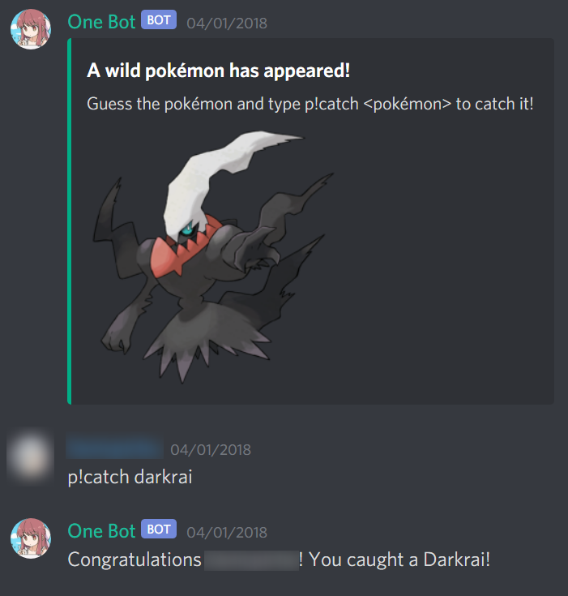

## Impromptu Introduction to Coding

When discord was just starting out, I became interested about how various bots worked on the platform. This piqued interest led me to creating a bot on discord as a hobby. At the time, I had no prior coding experience. Multiple coding languages were used to make a discord bot, but a specific tutorial I found on Youtube used a JavaScript flavor known as Node.js, which I opted to use for my own bot. From there, I began learning basic JavaScript to create my bot. I grew accustomed to using the Atom Text Editor for coding as well.

## What Did My Bot Do?

As I was essentially new to coding and haven't coded anything prior to creating the bot, I only did simple coding where if I typed a certain message in discord, the bot would respond with a message.

At first, I tested out various strings to see whether the bot could detect them and then in turn send a message in discord. Using trial and error, I managed to get it right. When I've gotten the messages down, I started using the discord API more by having the bot detect character IDs and returning them in messages.

As experience grew, I began experimenting with javascript random to upload random pictures from the bot from a set list of images I had on my computer. I also tried mimicking a popular pokemon discord bot command.

## What I have learned

This first experience with coding has helped me learned a lot. Although just a starting point, I learned how to do some basic JavaScript coding. I have a friend who was kind enough to join in on the fun and have him create his own discord bot for a while. Since he was more experienced in coding, I learned how to ask him questions about how things worked in a certain part of the code.

Looking back at my code, I could definitely rewrite it more efficiently and appealing, as all of the commands I used were if statements. There are many cases in my code where I could have used switch statements, but I haven't learned that far ahead at the time.
