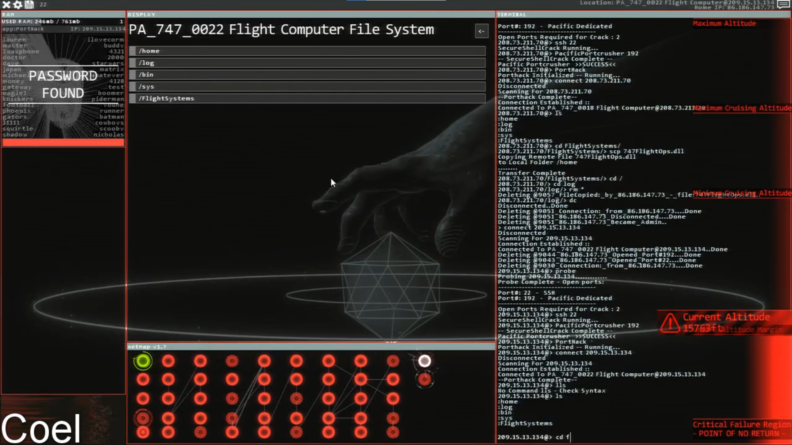

## First Experience with cmd.exe

My first experience with the command line came from a game I like called Hacknet. The game simulated computer hacking, albeit very gamified. The main interaction with the video game was via a terminal which I had to get accustomed to in order to play the game. As I have never used terminal commands before, it took quite some time to naturally get the feeling down of typing a command and knowing what it does. As the game is about simulated computer hacking, various tasks are provided which requires the player to navigate through various computers by running command lines to access certain files/directories and executing programs.

## Having Fun Navigating the Command Line

The further you progress in the game, the more fun it becomes. There are timed sections where you would need to be quick on typing commands or risk failing the task. Typing out basic commands like cd, scp, mv, cat, vi, and rm became second nature when I play the game. It was very helpful that I am a fast typer and can navigate through the command line quickly, making it at some points of the game a fast and thrilling adventure.

## What I have learned

The game has taught me the very basic commands of a command line. This proved useful because I became quickly accustomed to using the command line for tasks in ICS 212.
